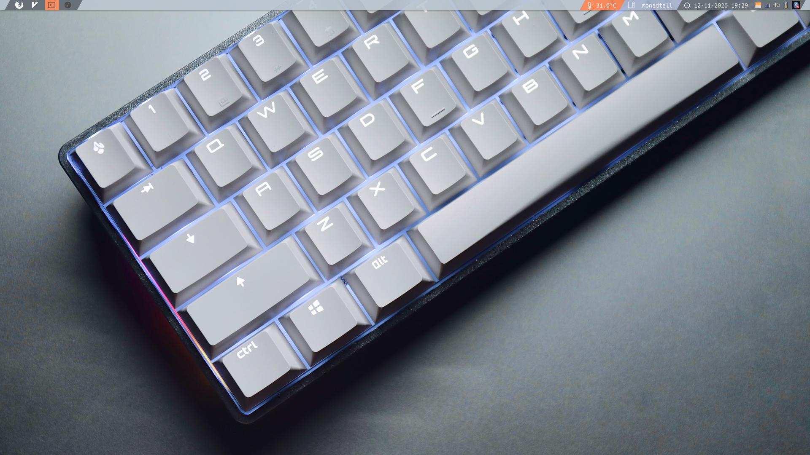

# Dotfiles



***Idioma***
- Español
- [English](./README.md)

# Tabla de contenido

- [Introducción](#introducción)
- [Configuraciíon basica de Qtile](#configuracioón-básica-de-qtile)
- [Útilidades del Sistema](#útilidades-del-sistema)
  - [Wallpaper](#wallpaper)
  - [Audio](#audio)
  - [Soporte para USB](#soporte-para-usb)
  - [Bluetooth](#bluetooth)
  - [Xprofile](#xprofile)
- [Software](#software)
  - [Core](#core)
  - [Aplicaciones](#aplicaciones)

<hr>

## Introducción

Repositorio con todos mis archivos y configuraciones para Arch Linux. Actualmente utilizo **Qtile** como mi window manager por defecto, ya que creo es el mas sencillo de implementar, programar (ya que funciona con Python) y extremadamente fácil de usar. Todo lo demas lo encontraras en practicamente cualquier sistema Arch, por ejemplo utilizo: LightDM como mi Display Manager, Pulseaudio como el servidor de sonido y Picom como compositor. 

## Configuración básica de Qtile

Estos son los atajos de teclado mas utilizados  

| Atajo                | Descripción                     |
| -------------------- | ------------------------------- |
| **mod + return**     | Lanza una consola               |
| **mod + k**          | Ventana siguiente               |
| **mod + j**          | Ventana anterior                |
| **mod + w**          | Cerrar ventana               	 |
| **mod + Tab**        | Cambiar disposicion           	 |
| **mod + [1234]**     | Ir al espacio de trabajo [1234] |
| **mod + ctrl + r**   | reiniciar qtile                 |
| **mod + ctrl + q**   | cerrar sesion                   |
| **mod + r**          | Lanzar Rofi                     |

Tener presente que utilizo Rofi como mi launcher de aplicaciones, necesitaras intalarlo para poder abrir aplicaciónes sin dejar una consola inutilizable. Puedes instalarlo escribiendo el siguiente comando en tu consola:

```bash
sudo pacman -S Rofi
```

Puedes encontrar la lista completa de atajos de teclado en "~/.config/qtile/config.py" dentro del arreglo de **Keys**.

## Útilidades del sistema

Esta seccion contendrá todo el Software basico que utilizo. Ten en cuenta que los cambios que realizes no seran permanentes, a menos que los explicites en el archivo [.xprofile](#xprofile).

### Wallpaper

Para definir o cambiar el fondo de escritorio utilizo un gestor de fondos llamado Nitrogen.

Nitrogen no funcionara si no tienes un **compositor** instalado en tu sistema.

Como dije anteriormente, utilizo Picom como mi comporisor por defecto. Puedes instalar tanto Nitrogen como Picom utilizando este comando en tu terminal:

```bash
sudo pacman -S nitrogen picom
```

Cuando finalize la instalación puedes iniciar Nitrogen directamente de tu consola o utilizando Rofi.


Para que el cambio sea permanente, deberas agregar la siguiente línea a tu archivo ~/.xprofile.

```bash
nitrogen --restore &
```

### Audio

Para tener audio en el sistema necesitaras instalar un servidor de audio, que servira como un punto medio entre el Hardware y ALSA (Advanced Linux Sound Architecture). También puedes utilizar **alsa-utils**, pero personalmente prefiero utilizar Pulseaudio, porque es mas sencillo de usar.

```bash
sudo pacman -S pulseaudio pavucontrol
```

Pavucontrol es el estándar actual para controlar Pulseaudio, puede ser lanzado desde la consola o desde Rofi. 

### Soporte para USB

Gestionar dispositivos de almacenamiento externos con Arch no es una tarea sencilla, para hacer de esta una experiincia mas amigable utilizo **Udiskie** que administrará de manera automática dispositivos de almacenamiento externos, ademas de agregar un icono interactivo a la bandeja de nuestro sistema:

```bash
sudo pacman -S udiskie
```

cuando termines de instalar, agrega la siguiente línea a tu archivo ~.xprofile:

```bash
udiskie -t &
```

### Bluetooth

Blueman, es la manera mas sencilla que he encontrado para parear dispositivos bluetooth con el sistema, Sin embargo, primero necesitaras instalar el protocolo de conexión junto al comando bluetoothctl:

```bash
sudo pacman -S bluez bluez-utils
```
Una vez que esten instalados necesitarás habilitar el servicio de bluetooth:

```bash
sudo systemctl enable bluetooth.service
```

Esto nos permitirá parear dispositivos con el comando bluetoothctl.


Sin embargo, parear dispositivos de forma manual puede resultar tedioso, personalmente prefiero utilizar el gestor de bluetooth "Blueman" que hara la conexion de manera automática por nosotros.

```bash
sudo pacman -S blueman
```

Recuerda iniciar blueman con el sistema, puedes hacerlo agragando la siguiente linea a tu ~/.xprofile:

```bash
blueman-applet &
```

### Xprofile

El archivo xprofile nos permite ejecutar comandos antes que inicie el gestor de ventanas (window manager).

Por ejemplo, si escribimos esta línea en ~/.xprofile:

```bash
cbatticon &
```

Añadira un icono de bateria a la bandeja del sistema cada vez que ingresemos

## Software

### Core


| Nombre                                                                                              | Descripción                      |
| --------------------------------------------------------------------------------------------------- | -------------------------------- |
| **[networkmanager](https://wiki.archlinux.org/index.php/NetworkManager)**                           | Gestor de conexiones de red      |
| **[network-manager-applet](https://wiki.archlinux.org/index.php/NetworkManager#nm-applet)**         | *NetworkManager* systray         |
| **[pulseaudio](https://wiki.archlinux.org/index.php/PulseAudio)**                                   | Servidor de audio                |
| **[pavucontrol](https://www.archlinux.org/packages/extra/x86_64/pavucontrol/)**                     | *pulseaudio* GUI                 |
| **[brightnessctl](https://www.archlinux.org/packages/community/x86_64/brightnessctl/)**             | Gestor de Brillo para notebooks  |
| **[udiskie](https://www.archlinux.org/packages/community/any/udiskie/)**                            | Gestor de dispositivos externos  |
| **[cbatticon](https://www.archlinux.org/packages/community/x86_64/cbatticon/)**                     | Systray de Bateria               |
| **[volumeicon](https://www.archlinux.org/packages/community/x86_64/volumeicon/)**                   | Systray de Volumen               |

### Aplicaciones


| Nombre                                                                | Descripción                       |
| --------------------------------------------------------------------- | --------------------------------- |
| **[alacritty](https://wiki.archlinux.org/index.php/Alacritty)**       | Emulador de Consola               |
| **[thunar](https://wiki.archlinux.org/index.php/Thunar)**             | Gestor de archivos grafico        |
| **[ranger](https://wiki.archlinux.org/index.php/Ranger)**             | Gestor de archivos desde Consola  |
| **[neovim](https://wiki.archlinux.org/index.php/Neovim)**             | Editor de texto basado en Consola |
| **[rofi](https://wiki.archlinux.org/index.php/Rofi)**                 | Lanzador de Aplicaciónes          |
| **[scrot](https://wiki.archlinux.org/index.php/Screen_capture)**      | Capturar pantalla                 |

