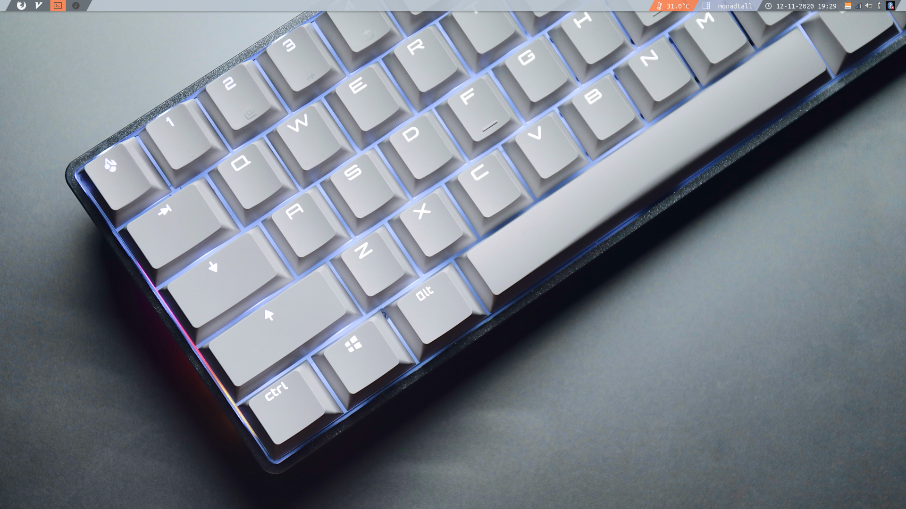

# Dotfiles



## Overview

Repository with all my Arch Linux dotfiles and configs. I am currently using **Qtile** as my  default window manager, since I consider it to be easy to set, pleasant to use and easy to program (since it works with Python). Everything else is pretty "standard" on an Arch Linux System: LightDM as the Display Manager, Pulseaudio as the sound server and Picom as the composer.

## Basic Qtile Configuration

These are some basic Keybinds.  

| Key                  | Action                     |
| -------------------- | -------------------------- |
| **mod + return**     | launch default terminal    |
| **mod + k**          | next window                |
| **mod + j**          | previous window            |
| **mod + w**          | kill window                |
| **mod + Tab**        | switch between layouts     |
| **mod + [1234]**     | go to workspace [1234]     |
| **mod + ctrl + r**   | restart qtile              |
| **mod + ctrl + q**   | logout                     |
| **mod + r**          | launch Rofi                |

Please note that i use Rofi as my app launcher, you'll need to install it order to be able to open apps without leaving a console unusable. You can do so by using the following command:

```bash
sudo pacman -S Rofi
```

You can find the full keybind list inside ".config/qtile/config.py" inside the **Keys** Section.
