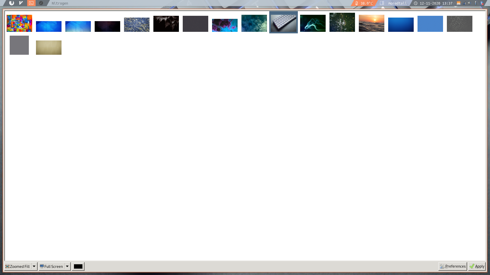
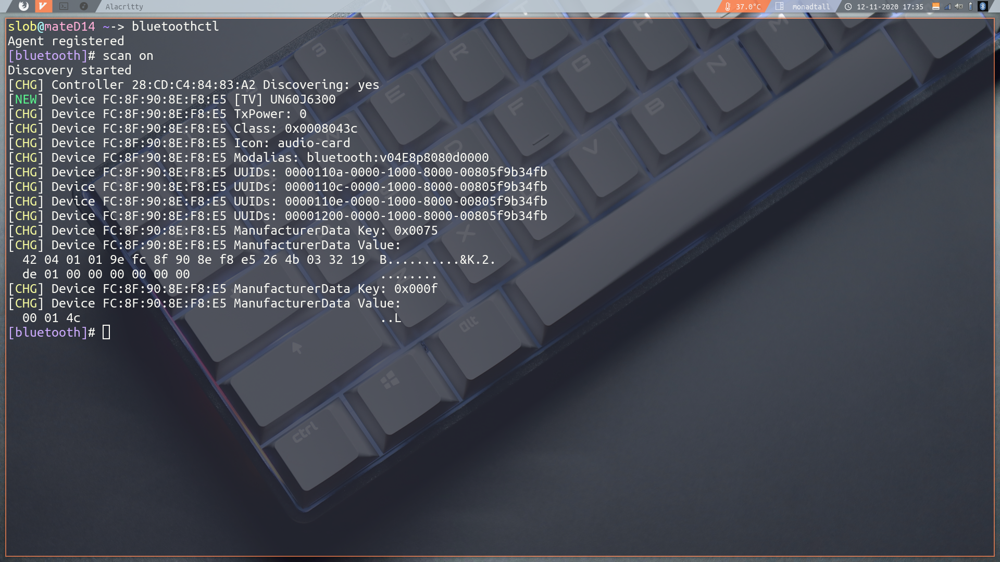

# Dotfiles


***Language***
- [Español](./README.es.md)
- English

# Table of Contents

- [Overview](#overview)
- [Basic Qtile configuration](#basic-qtile-configutarion)
- [System utilities](#system-utilities)
  - [Wallpaper](#wallpaper)
  - [Audio](#audio)
  - [USB support](#usb-support)
  - [Bluetooth](#bluetooth)
  - [Xprofile](#xprofile)
- [Software](#software)
  - [Core](#core)
  - [Apps](#apps)

<hr>

## Overview

Repository with all my Arch Linux dotfiles and configs. I am currently using **Qtile** as my  default window manager, since I consider it to be easy to set, pleasant to use and easy to program (since it works with Python). Everything else is pretty "standard" on an Arch Linux System: LightDM as the Display Manager, Pulseaudio as the sound server and Picom as the composer.

## Basic Qtile Configuration

These are some basic Keybinds.  

| Key                  | Action                     |
| -------------------- | -------------------------- |
| **mod + return**     | launch default terminal    |
| **mod + k**          | next window                |
| **mod + j**          | previous window            |
| **mod + w**          | kill window                |
| **mod + Tab**        | switch between layouts     |
| **mod + [1234]**     | go to workspace [1234]     |
| **mod + ctrl + r**   | restart qtile              |
| **mod + ctrl + q**   | logout                     |
| **mod + r**          | launch Rofi                |

Please note that i use Rofi as my app launcher, you'll need to install it order to be able to open apps without leaving a console unusable. You can do so by using the following command:

```bash
sudo pacman -S Rofi
```

You can find the full keybind list inside ".config/qtile/config.py" inside the **Keys** array.

## System utilities

This section contains all the basic software that i use. Keep in mind though that the changes made will not be permanent unless we explicitly state them in the [.xprofile](#xprofile) file.

### Wallpaper

To set or change the desktop wallpaper i use a desktop background browser called Nitrogen.

Nitrogen will not work out of the box unless you have a **composer** installed on your system.

As stated previously, I use Picom as my default composer. You can install both Nitrogen and Picom using the following command:

```bash
sudo pacman -S nitrogen picom
```

After the installation is complete you can run Nitrogen using Rofi or directly from your console.



In order to make the background permanent you'll have to add the following to your ~.xprofile:

```bash
nitrogen --restore &
```

### Audio

In order to have audio on your system you'll have to install an audio server wich will work as a middle ground between your hardware devices and ALSA (Advanced Linux Sound Architecture). You could also use **alsa-utils**, but personally i prefer Pulseaudio since i find it easier to use.

```bash
sudo pacman -S pulseaudio pavucontrol
```

Pavucontrol is the current standard for managing Pulseaudio. It can be launched through the console or Rofi 

### USB support

Managing external storage devices with Arch is not an easy task, to make this a more user friendly experience i use **Udiskie** wich will automount external storage devices and add an icon to our systray:

```bash
sudo pacman -S udiskie
```

after you are done with the installation, add the following line to your ~.xprofile:

```bash
udiskie -t &
```

### Bluetooth

The easiest way i've found to pair bluetooth devices with the system is using the Blueman, however you'll need to install the protocol stack plus the bluetoothctl util first:

```bash
sudo pacman -S bluez bluez-utils
```

After the installation is complete you'll need to enable the bluetooth service:

```bash
sudo systemctl enable bluetooth.service
```

This will give us access to the bluetoothctl command.



however, manually pairing devices can be quite tedious, i personally like to use the Blueman bluetooth manager that will allow us to automatically connect to any device within range from a front-end interface.

```bash
sudo pacman -S blueman
```

Remember to enable the blueman applet on your ~.xprofile adding the following line:

```bash
blueman-applet &
```

### Xprofile

The xprofile file allows us to to execute commands before the window manager is started.

For example, if we place this line in ~/.xprofile:

```bash
cbatticon &
```

Will add an interactive battery icon to our system tray every time we log in.

## Software

### Core


| Name                                                                                            | Description                          |
| --------------------------------------------------------------------------------------------------- | -------------------------------- |
| **[networkmanager](https://wiki.archlinux.org/index.php/NetworkManager)**                           | Self explanatory                 |
| **[network-manager-applet](https://wiki.archlinux.org/index.php/NetworkManager#nm-applet)**         | *NetworkManager* systray         |
| **[pulseaudio](https://wiki.archlinux.org/index.php/PulseAudio)**                                   | Self explanatory                 |
| **[pavucontrol](https://www.archlinux.org/packages/extra/x86_64/pavucontrol/)**                     | *pulseaudio* GUI                 |
| **[brightnessctl](https://www.archlinux.org/packages/community/x86_64/brightnessctl/)**             | Laptop screen brightness         |
| **[udiskie](https://www.archlinux.org/packages/community/any/udiskie/)**                            | Automounter                      |
| **[cbatticon](https://www.archlinux.org/packages/community/x86_64/cbatticon/)**                     | Battery systray                  |
| **[volumeicon](https://www.archlinux.org/packages/community/x86_64/volumeicon/)**                   | Volume systray                   |

### Apps


| Name                                                                  | Description              |
| --------------------------------------------------------------------- | ------------------------ |
| **[alacritty](https://wiki.archlinux.org/index.php/Alacritty)**       | Terminal emulator        |
| **[thunar](https://wiki.archlinux.org/index.php/Thunar)**             | Graphical file manager   |
| **[ranger](https://wiki.archlinux.org/index.php/Ranger)**             | Terminal file manager    |
| **[neovim](https://wiki.archlinux.org/index.php/Neovim)**             | Terminal based editor    |
| **[rofi](https://wiki.archlinux.org/index.php/Rofi)**                 | Run Dialog               |
| **[scrot](https://wiki.archlinux.org/index.php/Screen_capture)**      | Take Screenshot          |

